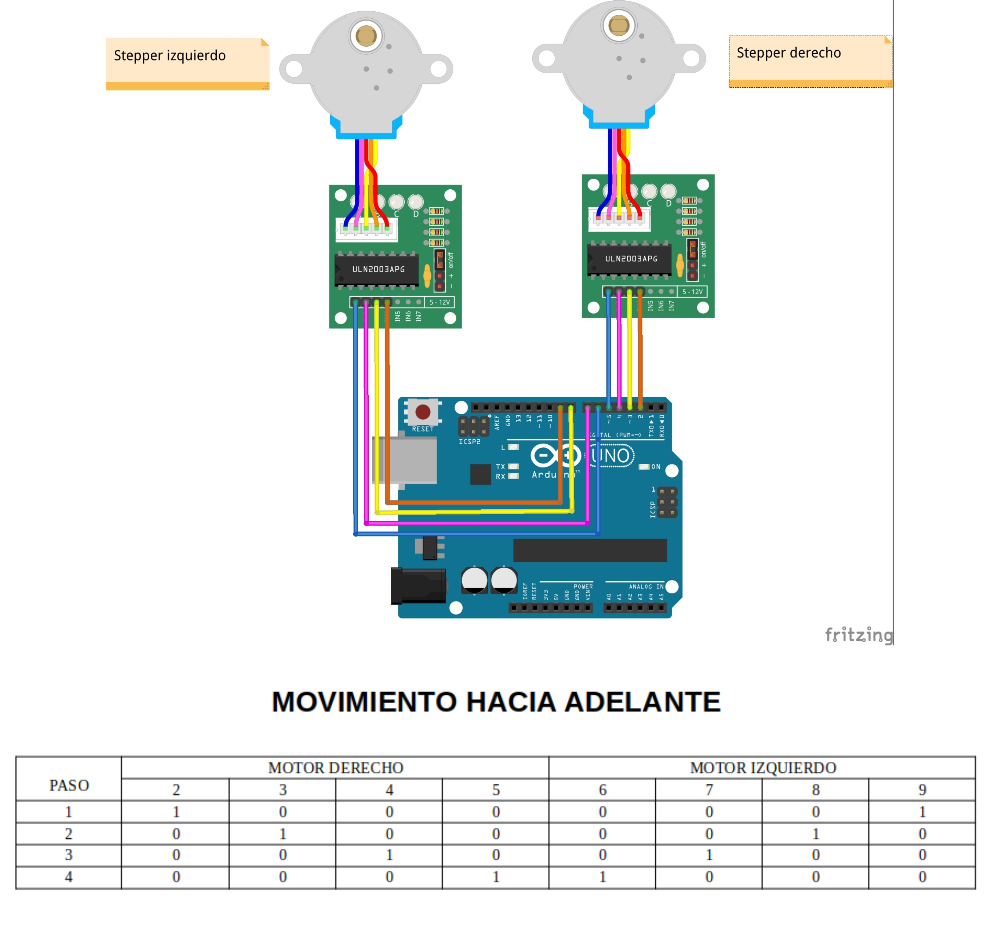
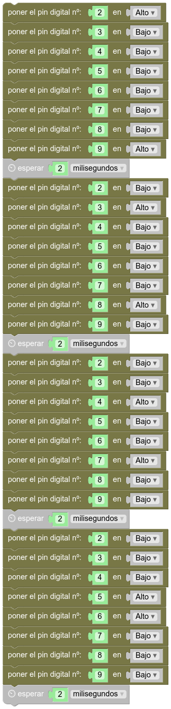

# Movimiento  hacia adelante
## Introducción  
Si hiciste el ejemplo anterior, estás preparado para crear distintos programas que permitan a tu Rupertobot moverse hacia adelante y hacia atrás, o moverse en cualquier sentido. 
## Adelante  
Si comprendiste el programa [del ejemplo anterior](movimiento.md), entenderás ahora que para que tu Rupertobot se mueva hacia adelante, **la rueda derecha debería girar en sentido horario, mientras que la izquierda debería hacerlo en sentido antihorario**. Esto implica que iremos activando los pines 2->3->4->5 en este orden para el motor derecho, y al mismo tiempo excitaremos 9->8->7->6 para el motor izquierdo:  
  
## Programa en MasayloBlockly  
La cosa no se complica demasiado. Sólo ten en cuenta que los grupos de cuatro pines se excitan en órdenes contrarios:  
  
## Programa tu Arduino  
Si prefieres tirar del IDE de Arduino, el código básico sería:  
```json
void setup() {
  pinMode(2, OUTPUT);
  pinMode(3, OUTPUT);
  pinMode(4, OUTPUT);
  pinMode(5, OUTPUT);
  pinMode(6, OUTPUT);
  pinMode(7, OUTPUT);
  pinMode(8, OUTPUT);
  pinMode(9, OUTPUT);
}

void loop() {
  digitalWrite(2, HIGH);
  digitalWrite(3, LOW);
  digitalWrite(4, LOW);
  digitalWrite(5, LOW);
  digitalWrite(6, LOW);
  digitalWrite(7, LOW);
  digitalWrite(8, LOW);
  digitalWrite(9, HIGH);
  delay(2);
  digitalWrite(2, LOW);
  digitalWrite(3, HIGH);
  digitalWrite(4, LOW);
  digitalWrite(5, LOW);
  digitalWrite(6, LOW);
  digitalWrite(7, LOW);
  digitalWrite(8, HIGH);
  digitalWrite(9, LOW);
  delay(2);
  digitalWrite(2, LOW);
  digitalWrite(3, LOW);
  digitalWrite(4, HIGH);
  digitalWrite(5, LOW);
  digitalWrite(6, LOW);
  digitalWrite(7, HIGH);
  digitalWrite(8, LOW);
  digitalWrite(9, LOW);
  delay(2);
  digitalWrite(2, LOW);
  digitalWrite(3, LOW);
  digitalWrite(4, LOW);
  digitalWrite(5, HIGH);
  digitalWrite(6, HIGH);
  digitalWrite(7, LOW);
  digitalWrite(8, LOW);
  digitalWrite(9, LOW);
  delay(2);

}
``` 
## Descarga el programa  
[Hacia adelante, programa para MasayloBlockly](./programas/adelante.bloc)  
[Hacia adelante, programa para IDE de Arduino](./programas/adelante.ino)  
  


