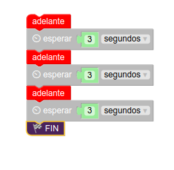

# Funciones (I)  
## Introducción  
Como habrás notado hasta ahora, podemos mover nuestro Rupertobot, pero los movimientos que obtenemos son continuos, esto es, no podemos alternarlos. Si empieza a moverse hacia adelante, así seguirá hasta que le cambiemos el programa. Es hora de darle un poco más de funcionalidad a nuestro robotejo, y para eso vamos a utilizar funciones.  
## Una primera aproximación  
Para empezar, si yo quisiera que mi Rupertobot fuera hacia adelante durante un tiempo, luego hacia atrás, giro izquierda, y giro derecha, para al final parar, podría usar bucles para repetir las secuencias que hemos visto en los ejemplos anteriores en el orden mencionado. Para el primer movimiento hacia adelante (no hago más porque la imagen que lo ilustrara sería kilométrica), haríamos algo así:  
  
¿Qué es lo que he hecho? He usado un bucle. Como hemos dicho antes, tomaremos como referencia el hecho de que los steppers de nuestro Rupertobot necesitan 2048 pasos para dar una vuelta completa. Si te fijas bien en el primer ejemplo para mover el robot adelante, hay que explicar la secuencia de los 4 pasos al microcontrolador. Por lo tanto, si ese programa estipula 4 pasos, y quiero que de 2048 antes de pararse, pues como 2048/4=512, el bucle deberá repetirse 512 veces.  
## ¿Cómo simplificar la programación? ¡Con funciones!  
Bueno, sí... Parece muy largo. La secuencia completa que hemos sugerido en el apartado anterior exigiría un programa cuatro veces más largo que el de la imagen. Así que vamos a explicarte qué es una función: **Una función es un conjunto de órdenes asociadas a un nombre que puede aceptar o proporcionar parámetros**. ¿Cómo?. ¿Que no te has enterado?. Lo confieso, yo tampoco. Vamos a intentar irlo ilustrando con ejemplos:  
## Configurar MasayloBlockly  
Si vas a utilizar el programa MasayloBlockly que desarrollamos desde el IES Maestro Juan de Ávila (es algo artesanal, pero en clase nos está resultando muy útil), debes saber que por motivos de espacio, no suelen aparecer en el menú de bloques de la izquierda todas las opciones. Si quieres algún elemento (como es este caso) que no te aparezca, debes pinchar en el símbolo del engranaje (**Preferencias**), seleccionar la opción **Nivel experto**, y dentro del abanico de posibilidades, elige **Funciones**. Asegúrate también de dejar marcada la opción **Entrada/Salida**, que es la que te permite ir escribiendo unos y ceros en los pines de Arduino
  
## Mi primera función  
Para empezar, vamos a crear una función muy simplificada, sin parámetros, que llamaremos simplemente *adelante*. Esta función se encargará de lo mismo que hemos hecho antes, es decir, impulsar al Rupertobot hacia adelante hasta que ambas ruedas den una revolución completa. Para ello, elige el bloque **Funciones**, y selecciona la primera pieza de puzzle, *Hacer*:  
  
Del programa anterior, quita la pieza *Fin* (no queremos interrumpir el programa definitivamente), y arrastra el resto dentro de la pieza *Hacer* (cambia el nombre **hacer** por **adelante**):  
  
Si volcaras el programa en el Rupertobot, verías que no hace nada aún. Se queda quieto. Parado. Como muerto. Qué penita da, ¿verdad?. Eso es porque hemos definido una función, pero no la hemos ejecutado aún. Esto es, hemos asociado al nombre ***adelante*** un conjunto de órdenes que repetirá 512 veces el proceso de mover las cuatro bobinas de cada uno de los dos stepper. Pero no hemos dado la orden de ejecutar la función. Vamos a resolver esto. Si te fijas, ahora, en el bloque **Funciones** aparece una nueva pieza, ***adelante***, que puedes ir arrastrando al escritorio principal de la aplicación. Para que veas cómo funciona, vamos a crear el siguiente programa: 
  
Si lo has hecho correctamente, verás que ahora el Rupertobot avanza 3 veces, en una secuencia espaciada cada 3 segundos, una distancia correspondiente a una revolución completa de cada rueda, esto es, para una rueda de unos 72 mm de diámetro, aproximadamente de 3,14*72=226,19 mm. Por supuesto, la idea es que podamos especificar la distancia que queremos que haga o incluso el ángulo que queremos de giro, pero esto será objeto de otra sección en esta web.  
## Programa tu Arduino  
Si quieres ver cómo quedaría la función ***adelante*** en la IDE de Arduino, te dejo el código en C++ con esta función y cómo se ejecutaría tres veces, tal y como especificábamos en el primer ejemplo:
```json
void adelante() {
  for (int count=0 ; count<512 ; count++) {
    digitalWrite(2, HIGH);
    digitalWrite(3, LOW);
    digitalWrite(4, LOW);
    digitalWrite(5, LOW);
    digitalWrite(6, LOW);
    digitalWrite(7, LOW);
    digitalWrite(8, LOW);
    digitalWrite(9, HIGH);
    delay(2);
    digitalWrite(2, LOW);
    digitalWrite(3, HIGH);
    digitalWrite(4, LOW);
    digitalWrite(5, LOW);
    digitalWrite(6, LOW);
    digitalWrite(7, LOW);
    digitalWrite(8, HIGH);
    digitalWrite(9, LOW);
    delay(2);
    digitalWrite(2, LOW);
    digitalWrite(3, LOW);
    digitalWrite(4, HIGH);
    digitalWrite(5, LOW);
    digitalWrite(6, LOW);
    digitalWrite(7, HIGH);
    digitalWrite(8, LOW);
    digitalWrite(9, LOW);
    delay(2);
    digitalWrite(2, LOW);
    digitalWrite(3, LOW);
    digitalWrite(4, LOW);
    digitalWrite(5, HIGH);
    digitalWrite(6, HIGH);
    digitalWrite(7, LOW);
    digitalWrite(8, LOW);
    digitalWrite(9, LOW);
    delay(2);
  }
}

void setup() {
  pinMode(2, OUTPUT);
  pinMode(3, OUTPUT);
  pinMode(4, OUTPUT);
  pinMode(5, OUTPUT);
  pinMode(6, OUTPUT);
  pinMode(7, OUTPUT);
  pinMode(8, OUTPUT);
  pinMode(9, OUTPUT);
}

void loop(){
adelante();
delay(3000);
adelante();
delay(3000);
adelante();
delay(3000);
while(true);
}
```  
## Descarga los programas  
[Ejemplo de funciones adelante, atrás, izquierda y derecha para MasayloBlockly](./programas/funcionessinParametros.bloc)  
[Ejemplo de funciones adelante, atrás, izquierda y derecha para la IDE de Arduino](./programas/funcionessinParametros.ino) 

