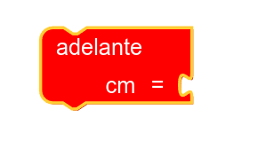
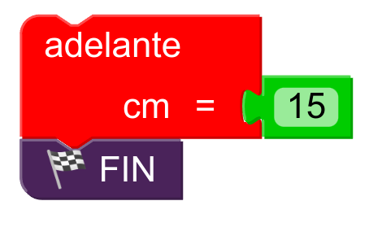
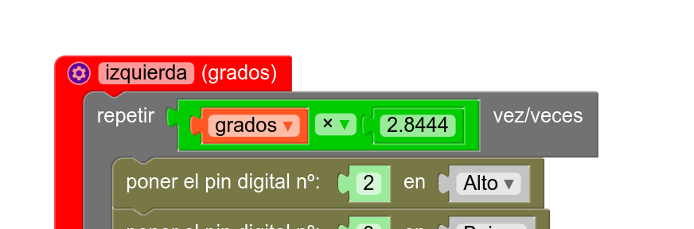
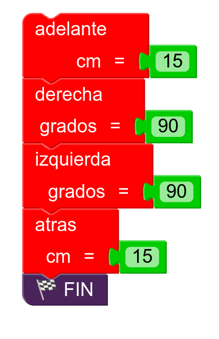

# Funciones (II)  
## Introducción  
Si has leído la sección anterior (es lo que uno supondría más lógico, pero cuando hablamos de estudiantes de Educación Secundaria, nunca desecho ninguna hipótesis), habrás aprendido a crear funciones de modo que puedes repetir el código varias veces, tantas como te limites a llamar a cada función por su nombre. No obstante, también hemos explicado que con ese enfoque, cada vez que llamemos a la función ***adelante***, por ejemplo, Rupertobot siempre avanzará exactamente la misma distancia: 3,14 multiplicado por 80, es decir, 251,33 mm (más o menos). Esto es así porque tal y como hemos construido la función, ésta siempre se va a ejecutar exactamente del mismo modo, tal y como la hemos escrito. Lo ideal, ahora, sería que pudiéramos introducir un valor que permitiera a ***adelante*** repetir el bucle de su interior un número de veces variable, según la distancia que queramos avanzar. Para ello, pasamos a explicar cómo usar parámetros con nuestras funciones.  
## Justificación matemática  
Lo que queremos hacer es usar funciones paramétricas en las que indiquemos en los casos de ***adelante*** y ***atras***, cuántos centímetros queremos movernos, y en el de ***izquierda*** y ***derecha***, cuántos grados queremos girar. Tiremos, entonces, de nuestros conocimientos de geometría: 

La función ***adelante*** original genera un total de 2048 pasos hacia adelante, lo que corresponde a una revolución completa en ambas ruedas del Rupertobot. Como el diámetro de dichas ruedas es alrededor de unos 80 mm (ya te he dicho que este dato varía según el grosor de las juntas tóricas), conociendo la fórmula de la longitud de una circunferencia, sabemos que eso equivaldría a un avance de 251,33 mm, o mejor, 25,13 cm. Quédate con el dato: 2048 pasos->25,13 cm. 

Lo que resta es una regla de tres (que me perdonen los profes de Matemáticas, sé que esto no está bien visto) sencilla: Si 25,13 cm exigen 2048 pasos, entonces avanzar 1 cm exigirá 2048/25,13=81,4873 pasos. Ten en cuenta que el algoritmo inicial de ***adelante*** aplica 4 pasos a cada repetición, así que 81,4873/4=20,3718. Ése es el número de veces que tenemos que repetir este proceso por cada cm que queremos avanzar.  

*Nota para tiquismiquis: si estás comprobando mi explicación calculadora en mano, puede que te baile algún número a la altura de milésimas o diezmilésimas, no lo estoy comprobando. Los números que manejo los saco de mi propia calculadora sin usar redondeos. Si quieres cambiar algo, eres muy libre, es tu robot*. 

Por otro lado, si has probado la función ***izquierda*** o ***derecha***, verás que como hacen avanzar una revolución completa a cada rueda (2048 pasos), haremos que el robot gire sobre su eje 180º. ¿Cuántos pasos necesito avanzar por grado sexagesimal, entonces?. La aritmética es sencilla, de nuevo. La función original, que da 2048 pasos, implica un giro de 180º. Así que un sólo grado corresponderá a 2048/180=11,3778 pasos. Teniendo en cuenta que las funciones originales implican 4 pasos por repetición, el algoritmo original debería repetirse 2.8444 veces por grado sexagesimal. Quédate, pues, con esos dos números: **20,3718** y **2,8444**  

Lo que vamos a hacer a continuación es modificar nuestras funciones para que acepten parámetros. Si has entendido el concepto de que una función es un grupo de órdenes asociadas a un nombre (por ejemplo, ***adelante***) que se ejecutan en orden cuando se llama a dicho nombre, entenderás ahora que las funciones pueden trabajar con parámetros. Un parámetro, o argumento, es un dato (de cualquier tipo, número entero, decimal, lógico... incluso se aceptan caracteres) que puedo dar yo a la función para que lo utilice de algún modo (*parámetros/argumentos de entrada*) o que puedo pedir a la función que me devuelva después de ejecutarse, como consecuencia de algún cálculo (*parámetros/argumentos de salida*). 

Lo sé, lo sé. Parece complicado. El movimiento se demuestra andando, así que vamos con ello.

## Uso de funciones con argumentos 
En este caso, vamos a trabajar con *argumentos de entrada*. Esto significa que cuando yo ejecute una función, primero tengo que proporcionarle un dato (en la función ***adelante***, cuántos cm quiero que se mueva hacia adelante) y dicha función lo utilizará para que Rupertobot haga lo que yo quiero. 

¡Bueno!. Pues en MasayloBlockly, retoma las funciones del ejemplo anterior. Vamos a modificar la función ***adelante*** para que acepte argumentos. En la esquina superior izquierda del bloque que representa dicha función, verás un icono azul en forma de engranaje. Si pinchas ahí, te ofrecerá la posibilidad de usar variables (parámetros)
  
  
Yo quiero introducir un argumento correspondiente a cuántos cm quiero que se mueva Rupertobot hacia adelante. Este número va a aceptar decimales, así que cambio la "x" que viene por defecto por el nombre "cm", y en el tipo, voy a especificar "decimal de punto flotante". Una vez lo haga, arrastra el bloque correspondiente a ese variable dentro del bloque "argumentos de entrada": 
  
Vuelve a pinchar en el engranaje, para que desaparezca el recuadro de configuración y te deje más espacio en la pantalla. Si ahora buscas la función ***adelante***, verás que el bloque ha cambiado ligeramente: ahora la pieza de puzzle acepta un bloque lateral, que será un número del bloque **Matemáticas** correspondiente al número de cm que quiero avanzar. 

  

¡Pero ojo!. Aún no hemos terminado. Ya he preparado mi función para que acepte argumentos, pero ¿cómo la modifico para que realmente mi Rupertobot se mueva la distancia especificada?. Sencillo (para mí, claro, que soy más viejo que un bosque y llevo meses trabajando en el Ruperti; pero tú también lo vas a entender enseguida). En el bloque *Repetir*, que originalmente incluía el número *512 veces*, vamos a introducir un bloque de *Matemáticas* correspondiente a operaciones (inicialmente lleva el signo *+*, pero sustitúyelo por una multiplicación). En dicho bloque multiplicaremos, por un lado, la variable que hemos creado, *cm* (está disponible en el bloque *Variables*; si no lo encuentras, vuelve a la configuración de MasayloBlockly y actívalo desde el nivel *Experto*), y por otro lado, el número 20,3718.
  
Sólo te queda poner el bloque que has creado en lugar del número original, *512*. Ahora vamos a usar la función modificada para hacer que Rupertobot avance 15 cm (la función acepta también números enteros): 
  
Vuelca el programa en tu robot y, regla en mano, comprueba la distancia que realmente se mueve. Si no te acaba de convencer el resultado, recalcula tú y sustituye el número *20,3718*. Pero yo creo que encontrarás más que aceptable el movimiento final.

## Modificamos el resto de funciones 
Lo que queda por hacer es sencillo. Repite el proceso con ***atras***, ***izquierda*** y ***derecha***. ***atras*** puede (y debería) utilizar la misma variable, *cm*, así como el número **20,7318**. En cuanto a ***izquierda*** y ***derecha***, deberías especificar el argumento *grados*, también de tipo decimal de coma flotante, y recordando que el número ahora sería **2,8444**. 
  

## Programa de prueba 
Haz algún programa que te permita comprobar si las funciones trabajan como deberían. Yo te propongo este, por ejemplo. Al acabar, el robot debería acabar exactamente en la misma posición que ha empezado: 

  

## Programa tu Arduino  
Si quieres ver cómo quedaría la nueva función ***adelante*** en la IDE de Arduino, te dejo el código en C++ con esta función y cómo se ejecutaría para avanzar 15 cm, tal y como especificábamos en uno de los ejemplos anteriores (si quieres el resto de funciones, más abajo puedes descargarlas):
```json
void adelante(float cm) {
  for (int count=0 ; count<cm * 20.3718 ; count++) {
    digitalWrite(2, HIGH);
    digitalWrite(3, LOW);
    digitalWrite(4, LOW);
    digitalWrite(5, LOW);
    digitalWrite(6, LOW);
    digitalWrite(7, LOW);
    digitalWrite(8, LOW);
    digitalWrite(9, HIGH);
    delay(2);
    digitalWrite(2, LOW);
    digitalWrite(3, HIGH);
    digitalWrite(4, LOW);
    digitalWrite(5, LOW);
    digitalWrite(6, LOW);
    digitalWrite(7, LOW);
    digitalWrite(8, HIGH);
    digitalWrite(9, LOW);
    delay(2);
    digitalWrite(2, LOW);
    digitalWrite(3, LOW);
    digitalWrite(4, HIGH);
    digitalWrite(5, LOW);
    digitalWrite(6, LOW);
    digitalWrite(7, HIGH);
    digitalWrite(8, LOW);
    digitalWrite(9, LOW);
    delay(2);
    digitalWrite(2, LOW);
    digitalWrite(3, LOW);
    digitalWrite(4, LOW);
    digitalWrite(5, HIGH);
    digitalWrite(6, HIGH);
    digitalWrite(7, LOW);
    digitalWrite(8, LOW);
    digitalWrite(9, LOW);
    delay(2);
  }
}


void setup() {
  pinMode(2, OUTPUT);
  pinMode(3, OUTPUT);
  pinMode(4, OUTPUT);
  pinMode(5, OUTPUT);
  pinMode(6, OUTPUT);
  pinMode(7, OUTPUT);
  pinMode(8, OUTPUT);
  pinMode(9, OUTPUT);
}

void loop() {
  adelante(15);
  while(true);
}
```  
## Descarga los programas  
[Ejemplo de las funciones con argumentos adelante, atrás, izquierda y derecha para MasayloBlockly](./programas/funcionesconParametros.bloc)  
[Ejemplo de las funciones con argumentos adelante, atrás, izquierda y derecha para la IDE de Arduino](./programas/funcionesconParametros.ino) 

