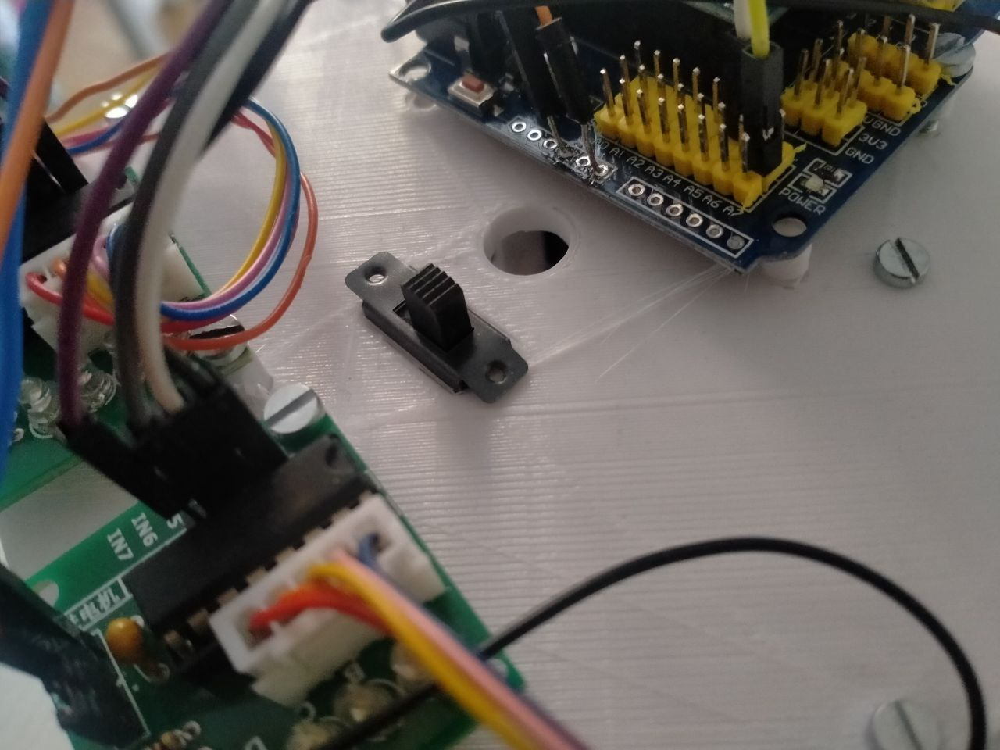
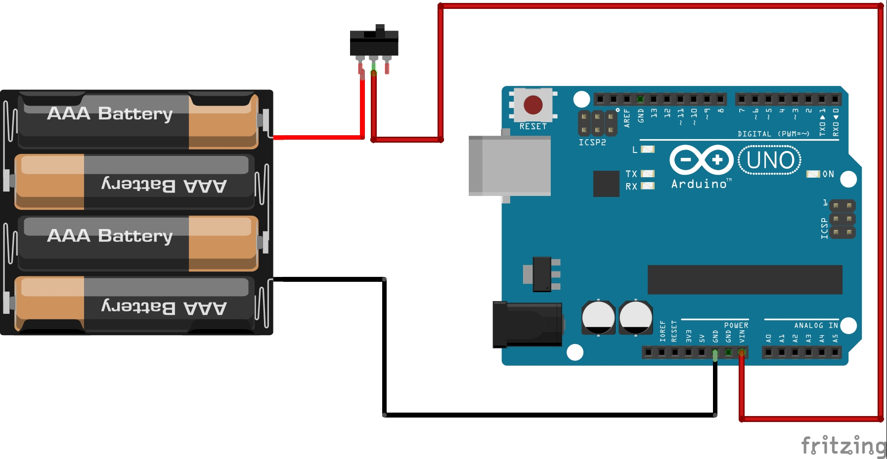
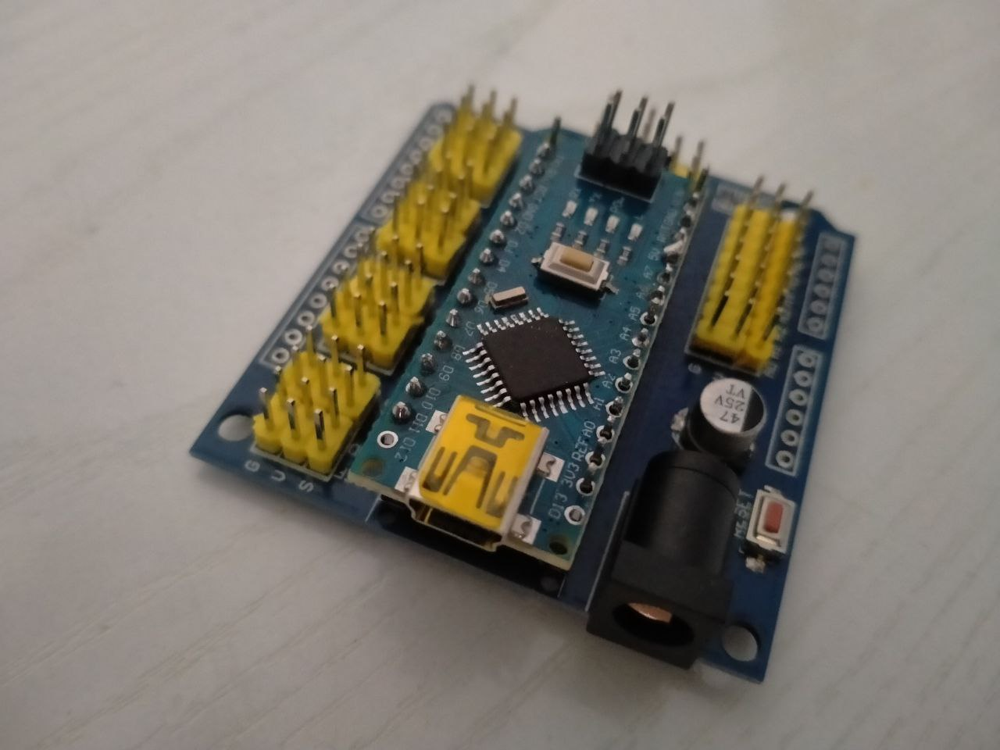
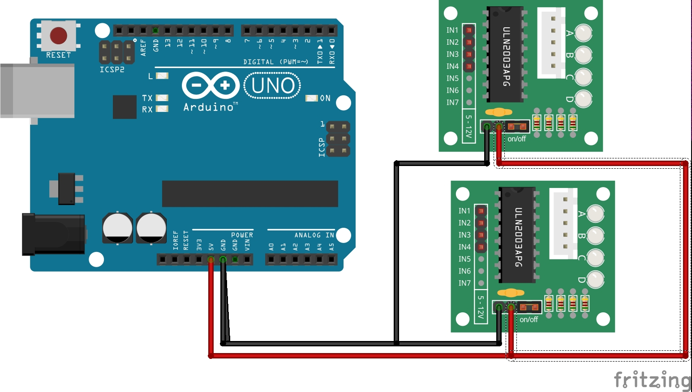
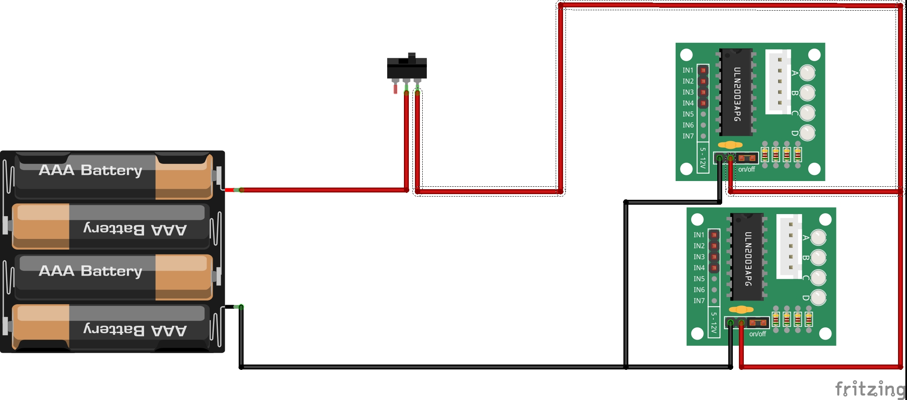

# ¿Qué portapilas usar?
Como ya he comentado en las instrucciones de montaje, tu Rupertobot está diseñado para que puedas usar un portapilas de 6 pilas AA en dos filas de 3, o si lo prefieres, puedes atornillar en las columnas interiores un portapilas de 5 pilas alineadas en fila. Incluso, dependiendo de tus posibilidades (pues no he hecho yo chapuzas ni ná cuando no dispongo del material adecuado), puedes usar portapilas de sólo 4 pilas. Eso sí, en ese caso, resígnate a que sólo funcionen los motores, y quizás los sensores de infrarrojos para hacer un siguelíneas. Despídete de detectar distancias con el sensor de ultrasonidos.
# Interruptor
En un principio, la plataforma superior está pensada para embutir un conmutador de los que usamos en las Aulas Taller de Tecnología, de tipo deslizante, de unos 15x7 mm de planta. Si tienes de otro tipo, siempre puedes tomar el archivo CAD de la plataforma superior y modificarlo para adaptarlo al tuyo.  
  
# ¿Cómo alimento?  
No es difícil. Espero que hayas tenido previsto soldar un par de cables primero a tu interruptor/conmutador, para facilitar el conexionado posterior. La idea es: polo positivo->Interruptor->Entraa **Vin** (no 5V) de Arduino/polo negativo->GND de Arduino (dicho mal y pronto).  
  
# ¿Y los motores?
Yo estoy alimentando los drivers ULN2003 de los motores directamente desde la salida de 5 V de mi Arduino (yo suelo utilizar la Arduino Nano con su shield, que me da más juego, al contar con tantos pines de 5 V y GND).  
  
Con este conexionado, a mí el Rupertobot me va de miedo (vale, no es un velocista como Masaylo, ya lo hemos dicho varias veces; el caso es que funciona muy bien).
  
Otra opción puede ser conectar ambos drivers al interruptor, de modo que en vez de darles la tensión de 5 V de Arduino, les llegue la de 9 V del portapilas. Yo aún no lo he probado, pero en teoría deberían funcionar igual e incluso mejor.  
  
## Resumen
La alimentación el Rupertobot es muy simplona: la Arduino se alimenta, con el interruptor/conmutador por medio, del portapilas a través de los pines Vin y GND. En cuanto a los driver ULN2003, puedes alimentarlos desde la tarjeta o directamente desde el portapilas. Decídete por la solución que más rabia te de.