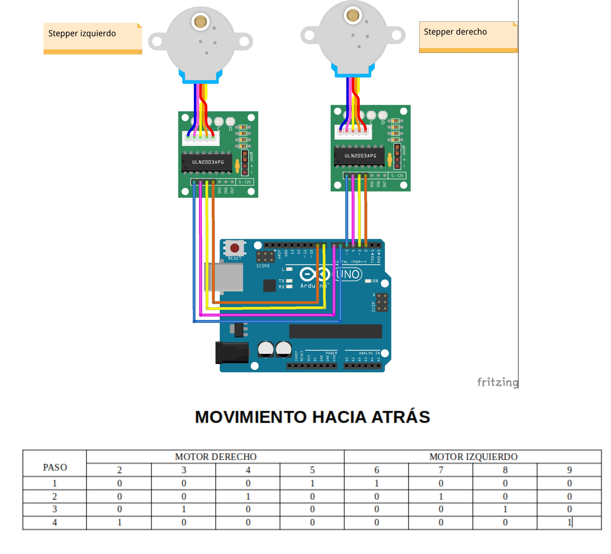
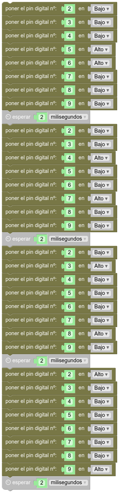

# Movimiento  hacia atrás
## Introducción  
En realidad, hago esta sección por vergüenza torera, pero si has hecho el ejercicio de [mover hacia adelante tu Rupertobot](adelante.md), esta sección no debería hacerte falta.
## Atrás  
Ahora toca activar los pines 5->4->3->2 en este orden para el motor derecho, y al mismo tiempo excitaremos 6->7->8->9 para el motor izquierdo:  
  
## Programa en MasayloBlockly  
Aquí te lo dejo:  
   
 ## Programa tu Arduino  
Si prefieres tirar del IDE de Arduino, el código básico sería:  
```json
void setup() {
  pinMode(2, OUTPUT);
  pinMode(3, OUTPUT);
  pinMode(4, OUTPUT);
  pinMode(5, OUTPUT);
  pinMode(6, OUTPUT);
  pinMode(7, OUTPUT);
  pinMode(8, OUTPUT);
  pinMode(9, OUTPUT);
}

void loop() {
  digitalWrite(2, LOW);
  digitalWrite(3, LOW);
  digitalWrite(4, LOW);
  digitalWrite(5, HIGH);
  digitalWrite(6, HIGH);
  digitalWrite(7, LOW);
  digitalWrite(8, LOW);
  digitalWrite(9, LOW);
  delay(2);
  digitalWrite(2, LOW);
  digitalWrite(3, LOW);
  digitalWrite(4, HIGH);
  digitalWrite(5, LOW);
  digitalWrite(6, LOW);
  digitalWrite(7, HIGH);
  digitalWrite(8, LOW);
  digitalWrite(9, LOW);
  delay(2);
  digitalWrite(2, LOW);
  digitalWrite(3, HIGH);
  digitalWrite(4, LOW);
  digitalWrite(5, LOW);
  digitalWrite(6, LOW);
  digitalWrite(7, LOW);
  digitalWrite(8, HIGH);
  digitalWrite(9, LOW);
  delay(2);
  digitalWrite(2, HIGH);
  digitalWrite(3, LOW);
  digitalWrite(4, LOW);
  digitalWrite(5, LOW);
  digitalWrite(6, LOW);
  digitalWrite(7, LOW);
  digitalWrite(8, LOW);
  digitalWrite(9, HIGH);
  delay(2);

}
``` 
## Descarga el programa  
[Hacia atrás, programa para MasayloBlockly](./programas/atras.bloc)  
[Hacia atrás, programa para IDE de Arduino](./programas/atras.ino)  
  


