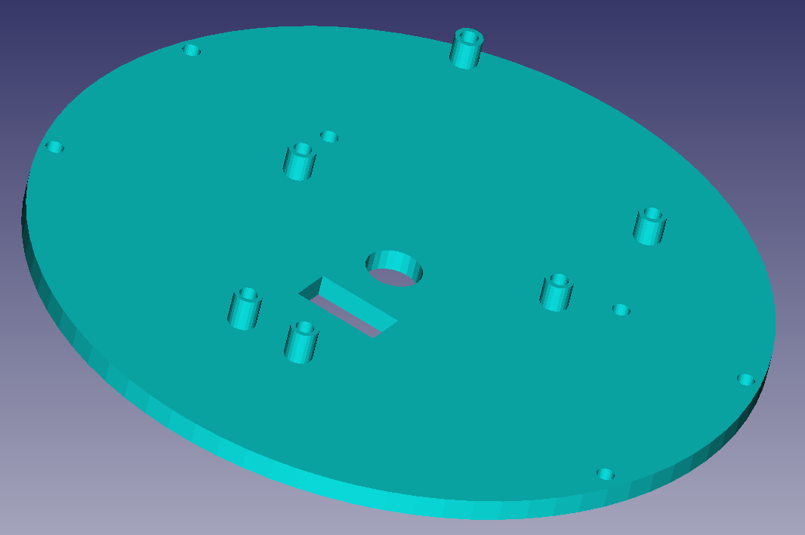

# Archivos en FreeCAD

## Descarga aquí los archivos en FreeCAD
| Imagen | Archivo CAD | Comentario |
|:-:|---|---|
|  | [Ballcaster](../cad/ballcaster.FCStd) | Proporciona un soporte al Rupertobot, intentando reducir el rozamiento con el suelo al mínimo |
|  | [Plataforma inferior](../cad/plataformaInferior.FCStd) | Incorpora un sistema de sujeción para bolígrafo o rotulador (experimental, pero la idea es que el Rupertobot acabe dibujando) |
|  | [Plataforma superior](../cad/plataformaSuperior.FCStd) | Tiene pendiente alguna señal que mejore la orientación a la hora de montarlo sobre la plataforma inferior |
|  | [Columna](../cad/columna.FCStd) | Une las plataformas superior e inferior con un ingenioso (a mí me lo parece) sistema de tornillos y tuercas (Necesitas imprimir seis) |
|  | [Rueda](../cad/ruedas.FCStd) | La rueda es la del Masaylo (que para eso lo diseñé yo, aunque me ayudaron los compis del Club de Robótica de Granada). En realidad, te sirve cualquier rueda del Escornabot |  
|  | Esta pieza, lo confieso, se la he fusilado directamente desde nuestro Masaylo a [Federico Coca](https://github.com/fgcoca). Que la fuerza te acompañe siempre, Fede. |  

