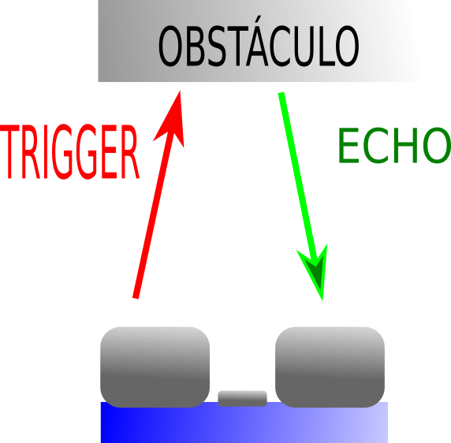

# Conexionado de sensores de infrarrojos y ultrasonidos
Estos sensores son muy sencillitos de instalar. Como verás, atacaremos, por un lado, su alimentación, y por otro lado, los pines digitales que comunicarán a la Arduino los cambios en el entorno que se detecten. Empecemos, pues.  
## Sensor de ultrasonidos  
(Extraído del primer manual del robot Masaylo): Detección de distancias por ultrasonidos
Como casi todos los otros campos de conocimientos tratados a lo largo de este texto relacionados con la Robótica Educativa, existe ya una extensa bibliografía en la red sobre el uso de módulos como el HC-SR04 o el PING de Parallax en la red. 
El principio básico de cualquier sensor de ultrasonidos es muy sencillo:    

- Un circuito emisor, comúnmente denominado “Trigger”, lanza un pulso de ultrasonidos (para ello, Arduino debe emitir un “1” en la patilla correspondiente).  
- Un temporizador se pone a 0 y empieza a contar.  
- Un circuito receptor, de nombre común “Echo”,  detecta el ultrasonido que ha rebotado (siempre que haya obstáculo) y envía un “1” lógico a una patilla de Arduino (puede ser o no la misma que hemos conectado al emisor, dependiendo del modelo).
- Detectado el “1” lógico en el pin conectado a “Echo” el temporizador se para.
- Conocida la velocidad del sonido (unos 343 m/sg), y que el sonido ha tenido que recorrer el espacio hasta el obstáculo dos veces, ida y vuelta, se realiza el cálculo correspondiente. En recorrer 1 cm, el tiempo que tarda el sonido es 0,000029155 sg. Teniendo en cuenta que la distancia es doble, un obstáculo localizado a 1 cm del sensor tardaría en detectarse 0,000058309 sg, es decir, 58,309 microsegundos, valor que utilizaremos para convertir el tiempo medido en distancia en cm.  

¡Pero de eso nos preocuparemos más tarde!. El caso es que nosotros estamos utilizando el sensor HCSR04, que tiene a la sazón cuatro pines (la imagen está extraída de Wikipedia):  
  

- Vcc y GND para la alimentación del sensor. Su conexión parece evidente.  
- Un pin, TRIG, que es el que emitirá un pulso cuando se le de un "1" lógico.
- Un pin, ECHO, que es el que enviará a la Arduino un "1" cuando detecte el pulso si éste encuentra un obstáculo y se ve rebotado de regreso.  

  | **CONEXIÓN DEL HCSR04**| | 
| :-----------: | :----------: |
| **PATILLA DEL SENSOR**      | **PIN DE ARDUINO** |
| Vcc | 5V | 
| Trig | 10 | 
| Echo | 11 | 
| GND | GND |  
  
Por supuesto, las patillas Trig y Echo puedes conectarlas a cualquier otro pin digital que te haya quedado libre (salvo el 0 y el 1, que no deben usarse por que son los pines que utiliza Arduino para comunicarse con tu ordenador mediante el puerto serie). En mi caso, utilizaré este conexionado para los ejemplos que iré desarrollando, por una mera cuestión de llevar un cierto orden.  

## Sensores de infrarrojos 

(Extraído de mi primer libro sobre Masaylo):  
Un sensor de infrarrojos participa del mismo principio funcional que uno de ultrasonidos: se alimenta un diodo LED infrarrojo para que emita un pulso de luz,detectable por un fototransistor, en caso de haber rebotado en algún obstáculo. No obstante, este tipo de sensores presenta características propias que lo distingue de un sensor de ultrasonidos:  

**Ventajas**  

- Son sensiblemente más baratos  
- Disponen de un potenciómetro que permite ajustar la sensibilidad del sensor  
- La emisión de la luz infrarroja es continua, no se necesita pin de control. Así que sólo hacen falta tres conexiones: V, GND y OUT (pin de señal). Son más fáciles de instalar y de manejo más simple por parte del sistema de control.  
- Pueden detectar cambios, si no de color, sí de luminosidad en la superficie sobre la que apuntan, lo que les hace ideales para el diseño de robot siguelíneas  

**Desventajas**  

- Su rango de detección es sensiblemente más bajo que en el caso de los ultrasonidos. Raramente superan los 30 cm, en el mejor de los casos, en el FC-51
- Su sensibilidad es muy vulnerable a los cambios de luz en la estancia en la que se encuentre el robot, lo que obliga a continuos reajustes mediante el potenciómetro anexo. En ocasiones es recomendable rodear el par formado por el LED y el fototransistor por algún tipo de capuchón improvisado con cinta o cartón que reduzca al máximo el ruido ocasionado por dichos cambios de luz.

Nosotros utilizaremos estos sensores de infrarrojos, concretamente el modelo FC-51 (es el más popular, pero tú puedes montar el que te parezca), a derecha e izquierda del Rupertobot, a modo de detectores blanco/negro. Con ello, podremos programar al robot como siguelíneas negras en campo blanco, o al revés, ya que cada sensor enviará un "1" (*veo blanco*) o un "0" (*veo negro*), y el programa podrá saber si se está saliendo del camino por la derecha o por la izquierda. 

Cada sensor tiene tres pines: Vcc y GND para alimentación, y OUT, que es el que dará un "1" o un "0" según lo que se encuentre:  

  

  | **CONEXIÓN DEL SENSOR DERECHO**| | 
| :-----------: | :----------: |
| **PATILLA DEL SENSOR**      | **PIN DE ARDUINO** |
| Vcc | 5V | 
| OUT | A0 (también se identifica como 14) | 
| GND | GND |  

  | **CONEXIÓN DEL SENSOR IZQUIERDO**| | 
| :-----------: | :----------: |
| **PATILLA DEL SENSOR**      | **PIN DE ARDUINO** |
| Vcc | 5V | 
| OUT | A1 (también se identifica como 15) | 
| GND | GND |  

De nuevo, eres muy libre de cambiar el patillaje. Yo prefiero esta elección porque me reservo la patilla 12 para el zumbador (si la conecto al 13, sonaría de modo muy molesto al cargar los programas desde el ordenador), y me gusta que estos dos sensores vayan juntos.  
  

# Resumen  
Usando sólo tres pines de nuestra queridísima Arduino, podemos dotar al Rupertobot de dos capacidades muy útiles: detectar obstáculos, cuya distancia puede medir, y detectar niveles de color (claro/oscuro) en el suelo que pisa. Con ello, podremos programarlo como salvaobstáculos, siguelíneas, resuelvelaberintos, y otro montón de palabras complejas muy chulas de usar. A medida que vayas familiarizándote con su programación, disfrutarás mucho de este pequeñuelo.  

