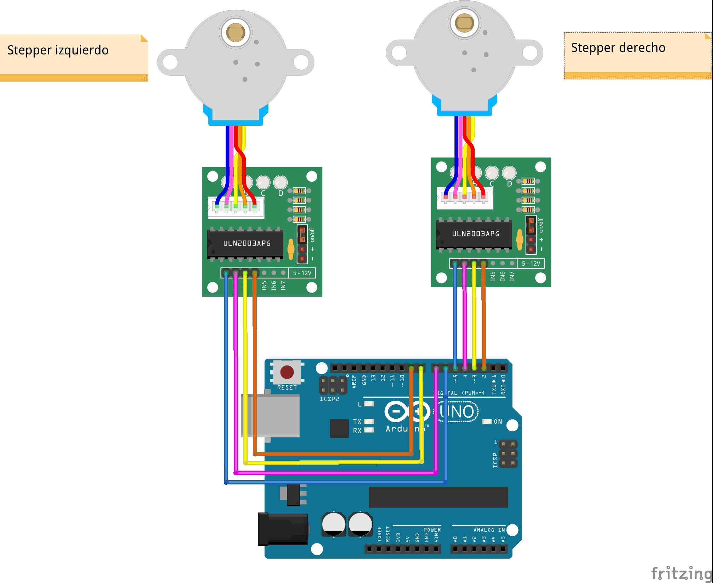

# Conexionado steppers
## Principio de funcionamiento
Los motores paso a paso, steppers en su acepción más vulgar y anglosajona, se caracterizan por incorporar 4 bobinas a las que hay que ir excitando en el orden correcto. (La ilustración que sigue pertenece a la Wikipedia, generada por el usuario Teravolt).  
<a href="https://en.wikipedia.org/wiki/Stepper_motor" target="blank"><a>  
Los motores que usamos son los 28BYJ-48, uno de los modelos más populares en el mundo maker. De potencia y velocidad no matan, pero para los objetivos educativos de Rupertobot tenemos hardware de sobra. Como decía, este modelo gira cada vez que excitamos una de sus bobinas (*dar un paso*) un total de unos 11.25 grados sexagesimales (lo que implica dar 32 pasos para lograr una vuelta completa).  
  
Por añadidura, el 28BYJ-48 incorpora un mecanismo reductor de 1/64, lo que vuelve a reducir 64 veces su avance, multiplicando por el mismo número, por lo tanto, su par motor. En total, estos motores precisan un total de 32*64=2048 pasos (repito, esto significa ir excitando cada una de sus cuatro bobinas en el orden adecuado) para dar una vuelta completa. Esto significa que cada paso implica un avance de 0.18º, lo que tendréis que aceptar que supone una precisión exquisita en un modelo tan baratito.  
<!-- En realidad, y atendiendo a [la página de Luis Llamas](https://www.luisllamas.es/motor-paso-paso-28byj-48-arduino-driver-uln2003/) (y que os recomiendo visitéis; Luis es un referente en el mundo maker), el reductor no es tan preciso, y el número auténtico de pasos para una revolución completa es de **4076**, no 4096.   -->
Esto atendiendo a los datasheet de este stepper... Pero, según mi experiencia, al final cada motor tiene sus propias características, según donde lo hayas comprado (yo me he encontrado motores con una relación de transmisión mucho más pequeña que han hecho salir disparado a mi escornabot, por ejemplo). Vamos, que al final tendrás que experimentar para encontrar el número adecuado.  

##Conexionado  

Vamos a conectar las bobinas de los motores de la siguiente manera:  

| **Motor derecho**| | |
| :-----------: | :----------: | :----------: |
| **ENTRADA DRIVER**      | **COLOR DE CABLE** |**PIN DE ARDUINO** |
| IN1 | Azul |5 | 
| IN2 | Rosa |4 | 
| IN3 | Amarillo | 3 |
| IN4 | Naranja |  2 |
  
  | **Motor izquierdo**| |  |
| :-----------: | :----------: | :----------: |
| **ENTRADA DRIVER**      | **COLOR DE CABLE** |**PIN DE ARDUINO** |
| IN1 | Azul |6 | 
| IN2 | Rosa |7 | 
| IN3 | Amarillo |8 | 
| IN4 | Naranja | 9 |

**SPOILER** Como ya te dije, nunca acabo de estar seguro del orden de conexión de los pines en los ULN2003. Normalmente, a mí me funciona así. No obstante, en cuanto empieces con tus primeras pruebas, si alguno de los motores funciona al revés, lo único que tienes que hacer es invertir el orden de estos cuatro cables. Sólo asegúrate de que **los conectas en orden, seguidos** (y a los mismos pines, sólo que al revés, claro).  

Aquí te dejo el esquema de conexión (repito, el que a mí me funciona en un principio):  
  

## Ojo a la alimentación

Por razones de simplicidad, en el esquema anterior no he añadido la alimentación de ambos driver, que te he explicado en el apartado de [Alimentación](alimentacion.md). **Pero tienes que alimentar ambos circuitos, como ya te he explicado, conectando las patillas marcadas con los signos - y + a la Arduino o al portapilas**. De lo contrario, los motores no se moverán.

