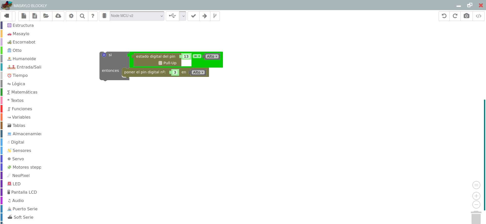

#Rupertobot
Rupertobot es mi nuevo diseño para lograr un robot educativo, impreso en 3D, fácil de montar en cualquier Aula-Taller de Tecnología. Lo estoy diseñando para que sea modular, simple de programar. Rupertobot no es un robot velocista como [Masaylo](https://clubroboticagranada.github.io/MASAYLO-CRG), pero a cambio tiene un control sobre su movimiento muchísimo mayor que su primo. Además, tiene bastante mejor localizado su centro de masas, lo que permite añadirle un bolígrafo o un lapiz para que realice dibujos basados en algoritmos geométricos (vale, esto último es aún MUY MEJORABLE, pero prometo que podrá hacerlo).  

#Sensores y actuadores
Como he dicho antes, Rupertobot intenta ser un robot modular para facilitar al máximo su montaje por parte de los no iniciados. Puede funcionar sin sensor ni actuador alguno, aparte de los típicos stepper 28BYJ-48, que tantas alegrías nos han dado con Arduino, y que en España tienen su máximo exponente en su uso con el [Escornabot](https://escornabot.com/es/index). Estos motores, conocidos también como motores paso a paso, se caracterizan por ir rotando fracciones de grado si se excitan sus cuatro bobinas en el orden adecuado.  

  
En un principio, Si montas el Rupertobot sólo con estos dos motores, podrás programarlo para que avance y gire en cualquier sentido, con una precisión milimétrica (bueno... más o menos... que es un robot de los baratitos, no nos flipemos).  
No obstante, a medida que ganes confianza, podrás dotar a tu Rupertobot de un sensor de distancia HC-SR04. Ello le permitirá detectar obstáculos y esquivarlos (o embestirlos.. todo depende de tí).  

  

También puedes completar el conjunto con dos sensores de infrarrojos modelo FC-51, que pueden usarse, a su vez, como sensores de distancia (con mucho menos alcance que el HCSR04), pero que a nosotros nos vendrá mucho mejor utilizar como discriminadores blanco-negro, para poder programar al Rupertobot como siguelíneas o resuelvelaberintos.  
  
De hecho, aquí tienes un detalle de cómo irían montados un tipo de estos sensores, o los dos, dentro del Rupertobot. Si no los vas a usar, no necesitas imprimir la pieza de soporte de sensores.  
  
Para finalizar, si así lo deseas (y no te importa el ruido infernal que puede montarse en un momento), también puedes montar un pequeño zumbador para dotar al Rupertobot con la posibilidad de emitir sonidos. No me importa reconocer que esta pieza no es mía, es obra de [Federico Coca](https://github.com/fgcoca), y me he tomado la libertad de importarla desde la [página del Escornabot](https://clubroboticagranada.github.io/MASAYLO-CRG).  
Aquí te dejo un detalle de cómo quedaría instalado el zumbador dentro de la plataforma superior:  
  
Un detalle que no podemos dejar pasar: las ruedas del Rupertobot no son operativas sin neumáticos. Para ello necesitarás unas juntas tóricas de unos 75 mm de diámetro exterior y al menos 3 mm de grosor (parece una tontería, pero a la larga es lo que más difícil se me hace de encontrar). Las medidas pueden variar un par de mm en su raio exterior, pero mejor si al menos es así de gruesa.  
  
#Programación
Nosotros programaremos el Rupertobot con mi aplicación [MasayloBlockly](https://agomezgar.github.io/masayloBlocklyLinux/www/), pero tú puedes utilizar el IDE que quieras (en realidad, lo más educativo sería usar el de Arduino, pero en un aula de Tecnología, en una clase de 55 minutos, el tiempo es limitadísimo).  
  
