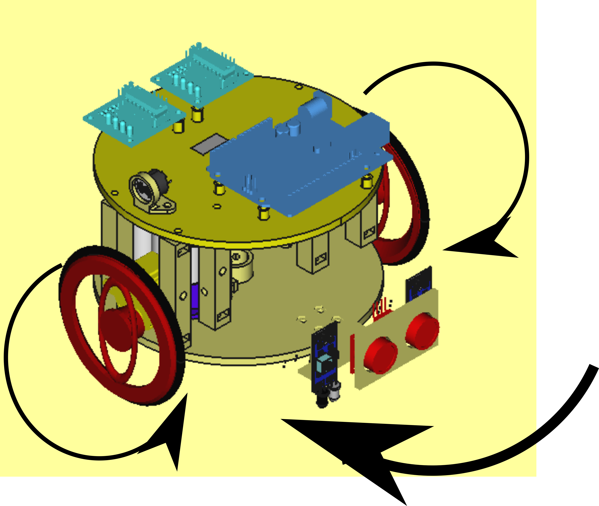
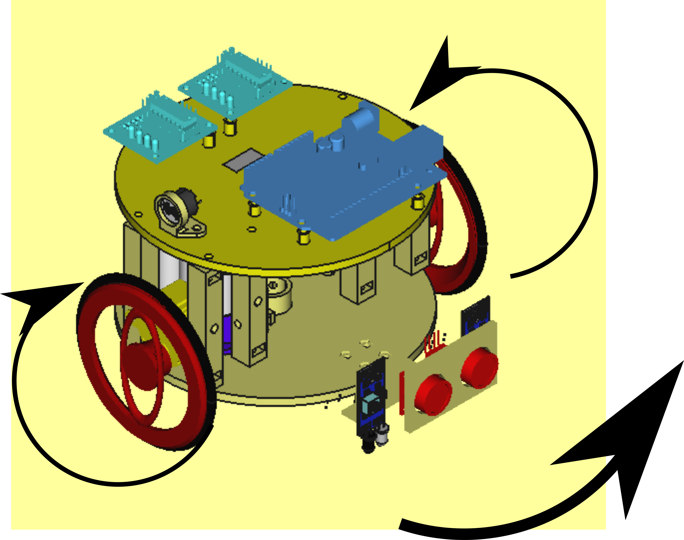
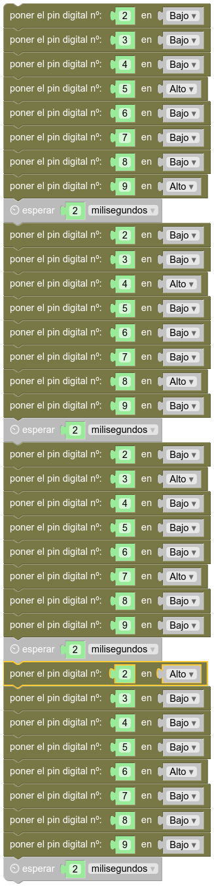
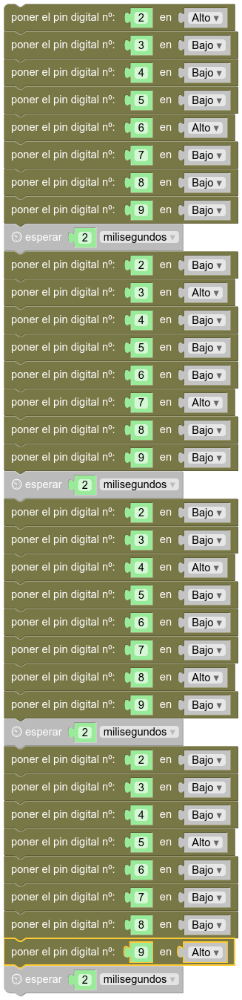

# Como hacer giros
## Introducción  
Entendiendo que vayas siguiendo los ejemplos que te pongo por orden, es de suponer que ya estarás deduciendo cómo hacer que gire. A grandes rasgos, me vienen a la mente dos modos de giro en este robot:  
- Hacer girar hacia adelante la rueda contraria al giro que queremos, y dejar parada la rueda de nuestro lado (Si giro a izquierda, la rueda derecha va hacia adelante, y la izquierda se para).  
- O podemos hacer girar hacia adelante la rueda contraria al giro que queremos, y para aumentar par y velocidad, **giramos hacia atrás la rueda del mismo lado hacia donde queremos girar**.  

|  |  |  
| :-----------: | :-----------: |  
|  |  |  
|  **Giro a derecha**  |  **Giro a izquierda**  |  

Eso significa que, para girar hacia la derecha, el motor izquierdo debe girar en sentido antihorario y el derecho en sentido horario, mientras que para girar hacia la izquierda, habrá que hacerlo al revés.

## Programas en MasayloBlockly  
A continuación te presento los programas para ambos tipos de giro:  

|  |  |
| :-----------: | :-----------: |  
| **GIRO A DERECHA** | **GIRO A IZQUIERDA** |
| **5->4->3->2** | **2->3->4->5** |  
| **9->8->7->6** | **6->7->8->9 **|
|  |  |  


## Programa tu Arduino  
Te dejo también los códigos:  

**CÓDIGO PARA GIRAR A IZQUIERDA EN ARDUINO**  
```json
void setup() {
  pinMode(2, OUTPUT);
  pinMode(3, OUTPUT);
  pinMode(4, OUTPUT);
  pinMode(5, OUTPUT);
  pinMode(6, OUTPUT);
  pinMode(7, OUTPUT);
  pinMode(8, OUTPUT);
  pinMode(9, OUTPUT);
}

void loop() {
  digitalWrite(2, HIGH);
  digitalWrite(3, LOW);
  digitalWrite(4, LOW);
  digitalWrite(5, LOW);
  digitalWrite(6, HIGH);
  digitalWrite(7, LOW);
  digitalWrite(8, LOW);
  digitalWrite(9, LOW);
  delay(2);
  digitalWrite(2, LOW);
  digitalWrite(3, HIGH);
  digitalWrite(4, LOW);
  digitalWrite(5, LOW);
  digitalWrite(6, LOW);
  digitalWrite(7, HIGH);
  digitalWrite(8, LOW);
  digitalWrite(9, LOW);
  delay(2);
  digitalWrite(2, LOW);
  digitalWrite(3, LOW);
  digitalWrite(4, HIGH);
  digitalWrite(5, LOW);
  digitalWrite(6, LOW);
  digitalWrite(7, LOW);
  digitalWrite(8, HIGH);
  digitalWrite(9, LOW);
  delay(2);
  digitalWrite(2, LOW);
  digitalWrite(3, LOW);
  digitalWrite(4, LOW);
  digitalWrite(5, HIGH);
  digitalWrite(6, LOW);
  digitalWrite(7, LOW);
  digitalWrite(8, LOW);
  digitalWrite(9, HIGH);
  delay(2);

}
```  

**CÓDIGO PARA GIRAR A DERECHA EN ARDUINO**  

```json  
void setup() {
  pinMode(2, OUTPUT);
  pinMode(3, OUTPUT);
  pinMode(4, OUTPUT);
  pinMode(5, OUTPUT);
  pinMode(6, OUTPUT);
  pinMode(7, OUTPUT);
  pinMode(8, OUTPUT);
  pinMode(9, OUTPUT);
}

void loop() {
  digitalWrite(2, LOW);
  digitalWrite(3, LOW);
  digitalWrite(4, LOW);
  digitalWrite(5, HIGH);
  digitalWrite(6, LOW);
  digitalWrite(7, LOW);
  digitalWrite(8, LOW);
  digitalWrite(9, HIGH);
  delay(2);
  digitalWrite(2, LOW);
  digitalWrite(3, LOW);
  digitalWrite(4, HIGH);
  digitalWrite(5, LOW);
  digitalWrite(6, LOW);
  digitalWrite(7, LOW);
  digitalWrite(8, HIGH);
  digitalWrite(9, LOW);
  delay(2);
  digitalWrite(2, LOW);
  digitalWrite(3, HIGH);
  digitalWrite(4, LOW);
  digitalWrite(5, LOW);
  digitalWrite(6, LOW);
  digitalWrite(7, HIGH);
  digitalWrite(8, LOW);
  digitalWrite(9, LOW);
  delay(2);
  digitalWrite(2, HIGH);
  digitalWrite(3, LOW);
  digitalWrite(4, LOW);
  digitalWrite(5, LOW);
  digitalWrite(6, HIGH);
  digitalWrite(7, LOW);
  digitalWrite(8, LOW);
  digitalWrite(9, LOW);
  delay(2);

}
```

## Descarga los programas 
[Giro a derecha, programa para MasayloBlockly](./programas/giroDerecha.bloc)  
[Giro a izquierda, programa para MasayloBlockly](./programas/giroIzquierda.bloc)  
[Giro a derecha, programa para IDE de Arduino](./programas/giroDerecha.ino)  
[Giro a izquierda, programa para IDE de Arduino](./programas/giroIzquierda.ino)  

  


