# Instrucciones de montaje
A lo largo de este documento (que intentaré ir haciendo más extensivo y claro con el tiempo), te explico cómo montar un Rupertobot.
## Plataforma inferior con ballcasters
Necesitarás las siguientes piezas:  

| Relación de piezas      | 
| :-----------: |
| Plataforma inferior(1 pieza)  
    | 
|Ballcasters (2 piezas)  
   | 
|Soporte de sensores IR/US (1 pieza, optativo; no la montes si no tienes los sensores)  
   | 
|Portapilas para 6 pilas AA(1 pieza); si en su lugar deseas usar un portapilas de solo 5 pilas, del tipo las cinco en línea, podrás asegurarlo a las columnas que montarás después)  
   | 
|Tuercas de métrica 3 (8 piezas)  
   |
|Tornillos de métrica 3 y 12 mm (8 piezas)  
    | 
### Proceso de montaje 

 Dependiendo de si vas a poner el soporte de los sensores de ultrasonidos/infrarrojos o no, el proceso es relativamente sencillo: coloca los dos ballcaster por debajo de la plataforma inferior; el trasero ya lo puedes sujetar con cuatro tornillos y tuercas, encajando cada tuerca en la depresión prevista a tal fin en la plataforma:  
 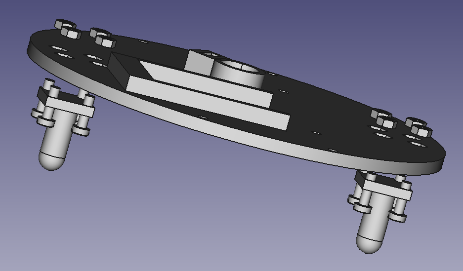  
 Si quieres dejar montado el soporte para sensores, el mejor sitio para instalarlo es delante del hueco del portapilas; como es lógico, entonces las tuercas de esa zona no las encajarás contra los huecos en la plataforma, sino contra el propio sensor:  
 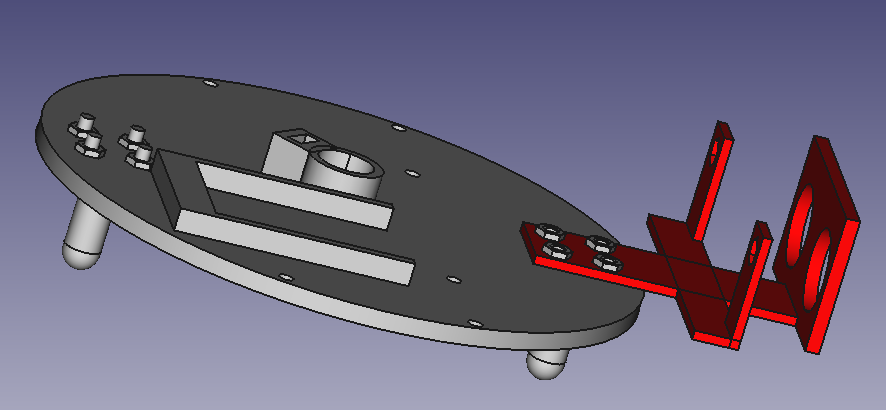  
Si vas a usar el portapilas de 6, recuerda que lo debes encajar en la protuberancia lista a tal efecto en la plataforma, aunque no lo vas a poder asegurar hasta que montes las columnas:  
 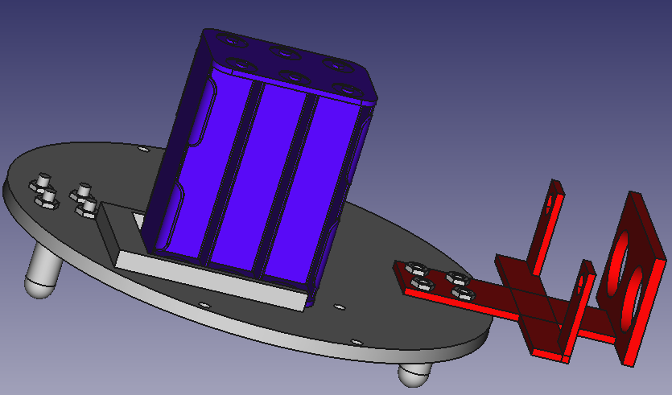
### Resumen
Te dejo aquí una animación que resume el proceso hasta ahora (bien sencillo, como podrás comprobar).  
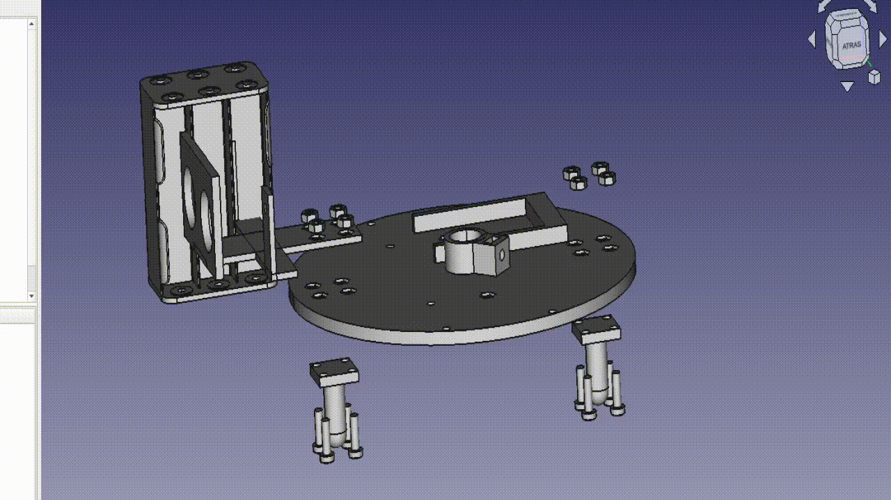  
## Montaje de las columnas
Ahora tienes que tener preparada la siguiente relación de elementos:  

| Relación de piezas      | 
| :-----------: |
| Columna (6 piezas) (atentos, que importa la posición en la que rota; orientaros siempre por la posición del hueco que dejo para embutir la tuerca)  
     | 
|Tuercas de métrica 3 (12 piezas)  
   | 
|Tornillos de métrica 3, longitud 14-16 mm 
   |  
###Proceso de montaje
En esta ocasión es sencillo. Mete las tuercas en los huecos de las columnas pensado para ellas, y atorníllalas a la plataforma inferior desde abajo con los tornillos. Da un poco igual la longitud exacta de estos tornillos, siempre que exceda de los 12 mm y no sobrepase los 20 mm.  
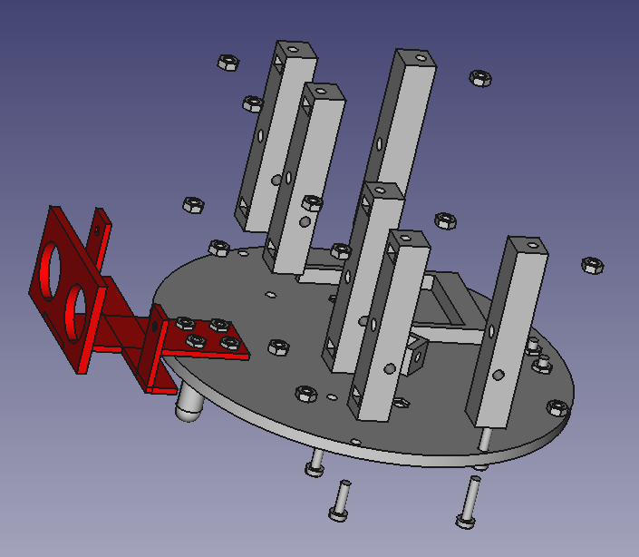  
### Resumen
De nuevo una animación, ¡no dirás que te lo estoy poniendo difícil!  
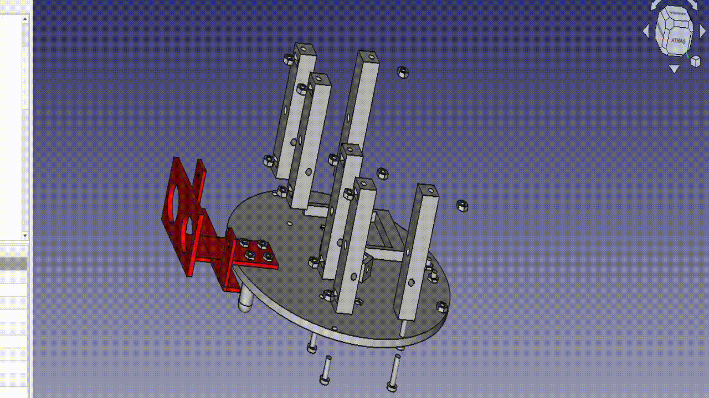  
##Motores y plataforma superior  
Es el momento de atornillar nuestros stepper y cerrar al Rupertobot con la plataforma superior. (Te aconsejo que embutas primero el interruptor en esta última, con dos cables ya soldados para alimentar luego a la Arduino).  

| Relación de piezas      | 
| :-----------: |
| Stepper modelo 28BYJ-48 (2 piezas)  (aquí es donde comprobarás si has orientado correctamente las columnas laterales, porque de lo contrario los motores te quedarán descuadrados o directamente no podrás atornillarlos).  
     | 
 |Plataforma superior   
     | 
|Tuercas de métrica 3 (4 piezas)  
   | 
|Tornillos de métrica 3, longitud 16 mm (8 piezas)
   |  
###Proceso de montaje
Atornillamos los stepper a las columnas (insisto, tienen orientación con respecto al eje Z; se supone que los motores paso a paso van atornillados a los taladros más bajos de las columnas)  
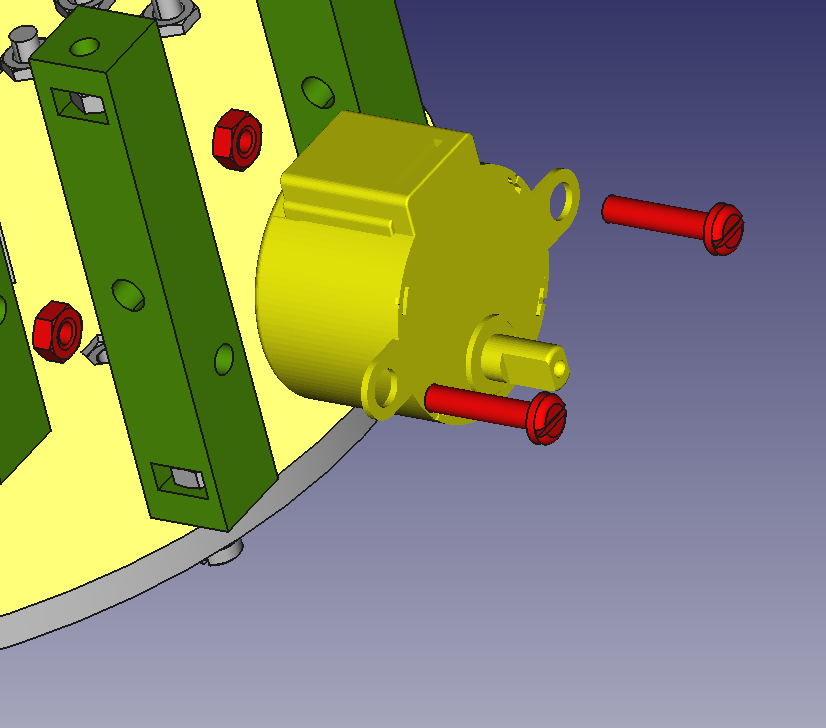  
Nos toca colocar la plataforma superior (ojo de nuevo a la orientación si usas el soporte para sensor de infrarrojos; en teoría, la Arduino debería quedar en el frontal del robot). Como puedes comprobar, se asegura atornillándola a las columnas que ya habías fijado a la plataforma inferior. ¡Está todo pensado!.  
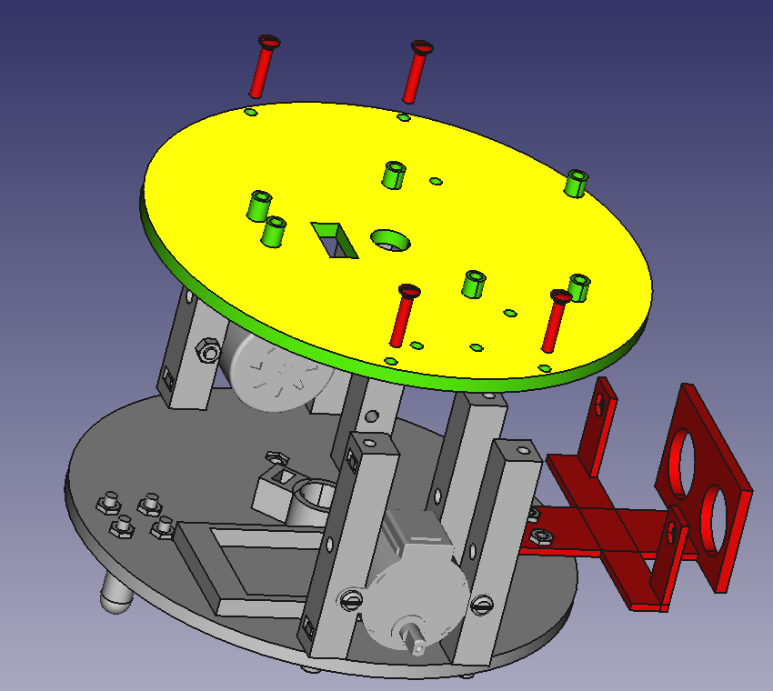
¡Cada vez queda menos!. De nuevo te dejo una animación de esta fase del proceso (me he equivocado, me faltan dos tornillos para atornillar la plataforma superior a las columnas interiores, pero me da mucha pereza rehacer la animación):  
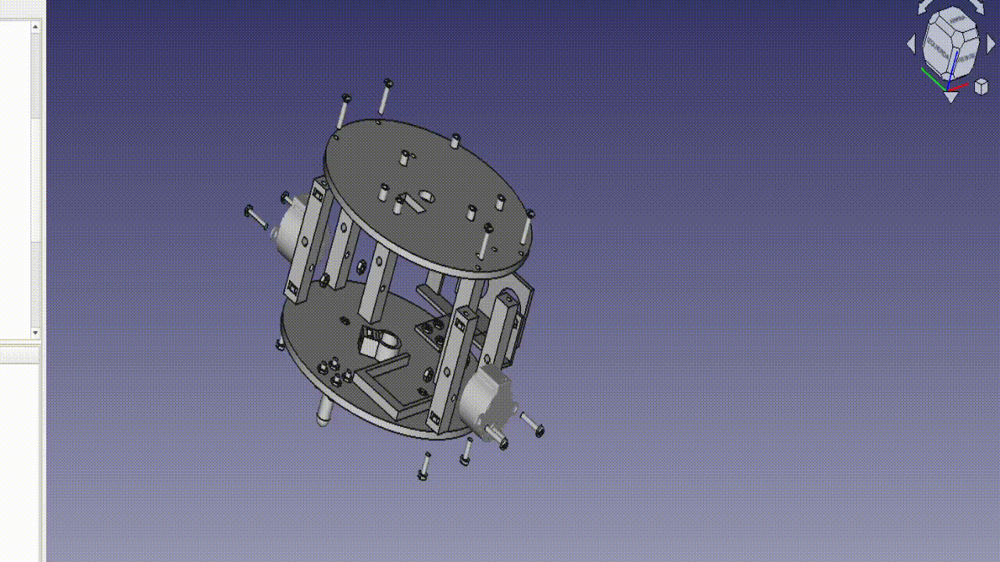  
## Ruedas y circuitería  
¡Bueno!. Pues vamos a ir cerrando el tema, que después del montaje mecánico nos queda todo el rollo del conexionado.  

| Relación de piezas      | 
| :-----------: |
|Ruedas (tendrás que calzarlas con una junta de 72x8 mm, a modo de neumático) 
     | 
 |Arduino UNO o Arduino NANO montada sobre su shield 
     | 
|Driver de control de los motores paso a paso, ULN2003 
   | 
|Tornillos de métrica 3, longitud 16 mm (8 piezas + 2 de 10 mm si quieres asegurar las ruedas)
   |  
|Tuercas de métrica 3 (6 piezas para la Arduino y los driver + 2 si quieres asegurar las ruedas)
   |  

En cuanto al tema de ruedas, os contaré un secreto: vale cualquiera de las del Escornabot (echad un vistazo a Thingiverse) o las del [Masaylo](https://clubroboticagranada.github.io/MASAYLO-CRG). El caso es que están diseñadas para ajustarse bastante bien al eje de los motores. No obstante, para no parecer poco profesional (spoiler: no lo soy en absoluto, pero bueno...) no he querido dejar las ruedas sin su propio sistema de ajuste por tornillo. Si veis que os quedan bailonas en el eje, usad un tornillo de 10 mm y una tuerca, ambos de métrica 3.  
  
Lo que queda ya es cosa de poco. Atornillamos la circuitería (nuestra Arduino y los dos driver de ambos stepper) a la plataforma superior  
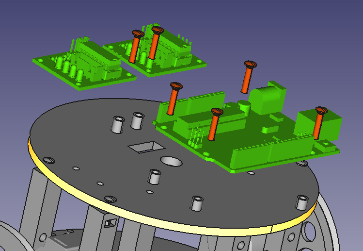  
¡Y ya estaría todo!. Para rematar, te dejo la última animación del montaje. ¡Espero que no hayas tenido mucho problema con el ensamblado!. Recuerda que Rupertobot es aún un robot educativo, pero experimental.  
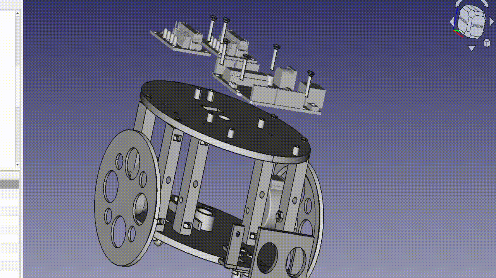  

