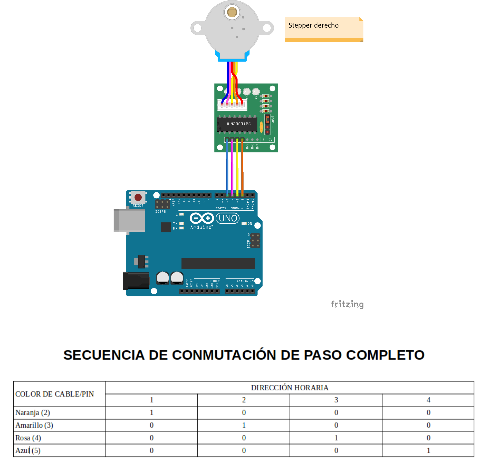
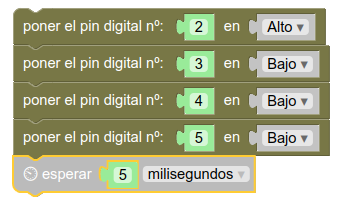
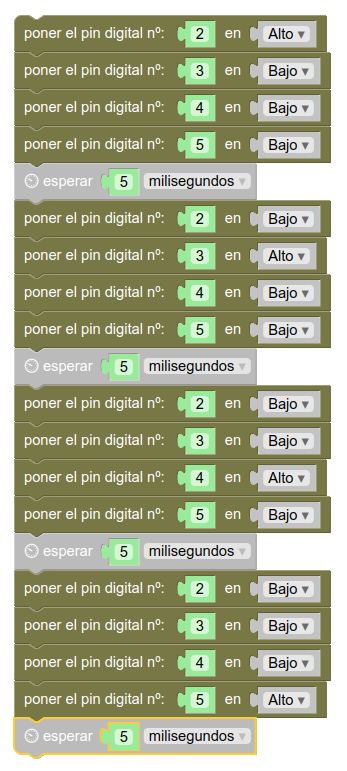

# Movimiento  
## Introducción  
En esta sección vamos a asegurar lo que sabemos sobre el funcionamiento de un motor de tipo paso a paso y aprenderemos a programar a nuestro Rupertobot para que pueda avanzar, retroceder y girar.  
## Mover una rueda  
Como te explicaba en el apartado de [conexionado de estos motores](conexionadoStepper.md), su principio de funcionamiento reside en que cuenta con cuatro bobinas que debemos ir excitando (esto es, proporcionarle tensión mediante un "1" lógico) en el orden adecuado. Para nuestro primer ejemplo, elegiremos la rueda derecha del Rupertobot, que está controlada por los pines 2, 3, 4 y 5 de nuestra Arduino. Ésta debería ser la secuencia lógica de control:  
  
Aunque existen otros modos más eficientes de mover nuestro motor, este es el más sencillo: excitar una bobina a la vez. Se conoce como el **modo de paso completo** de funcionamiento de un Stepper. Veamos cómo programarlo en MasayloBlockly...  
## Programación mediante MasayloBlockly  
En el **modo primerizo** de MasayloBlockly, sólo necesitaremos los grupos de piezas **Arduino** y **Tiempo**. Tal como hemos especificado en el gráfico anterior, la idea es ir excitando una bobina cada vez, y dejar un tiempo mínimo (del orden de milisegundos) para permitir que se produzca el movimiento, tal que así:  
  
Sencillo, ¿verdad?. Pues sólo tenemos que repetir el proceso tres veces más, para ir excitando una bobina a la vez, por orden. Al finalizar el programa, como ya imaginarás, vuelve a empezar. El resultado es un movimiento infinito de la rueda en sentido horario:  
  
Ahora, dependiendo de lo rápido que quieras que vaya tu Rupertobot, sólo tienes que reducir el tiempo que esperas entre cada conmutación. Eso sí, debes dejar el tiempo mínimo para permitir el movimiento del eje. Por debajo de 2 milisegundos, ya te dará problemas. 
## Programa tu Arduino  
Si prefieres tirar del IDE de Arduino, el código básico sería:  
```json
void setup() {
  pinMode(2, OUTPUT);
  pinMode(3, OUTPUT);
  pinMode(4, OUTPUT);
  pinMode(5, OUTPUT);
}

void loop() {
  digitalWrite(2, HIGH);
  digitalWrite(3, LOW);
  digitalWrite(4, LOW);
  digitalWrite(5, LOW);
  delay(5);
  digitalWrite(2, LOW);
  digitalWrite(3, HIGH);
  digitalWrite(4, LOW);
  digitalWrite(5, LOW);
  delay(5);
  digitalWrite(2, LOW);
  digitalWrite(3, LOW);
  digitalWrite(4, HIGH);
  digitalWrite(5, LOW);
  delay(5);
  digitalWrite(2, LOW);
  digitalWrite(3, LOW);
  digitalWrite(4, LOW);
  digitalWrite(5, HIGH);
  delay(5);

}
``` 
## Descarga el programa  
[Rueda derecha, sentido horario, programa para MasayloBlockly](./programas/ruedaDerechaSHorario.bloc)  
[Rueda derecha, sentido horario, programa para IDE de Arduino](./programas/ruedaDerechaSHorario.ino)  
